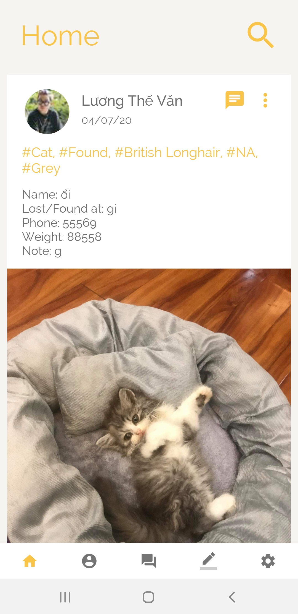
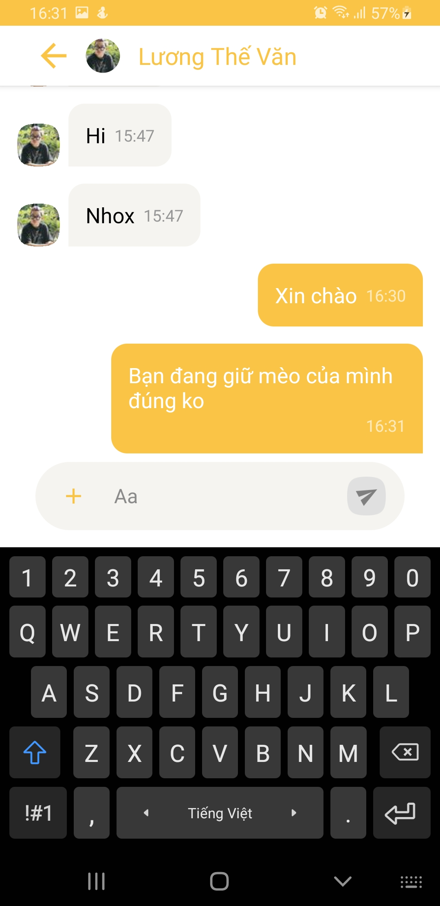
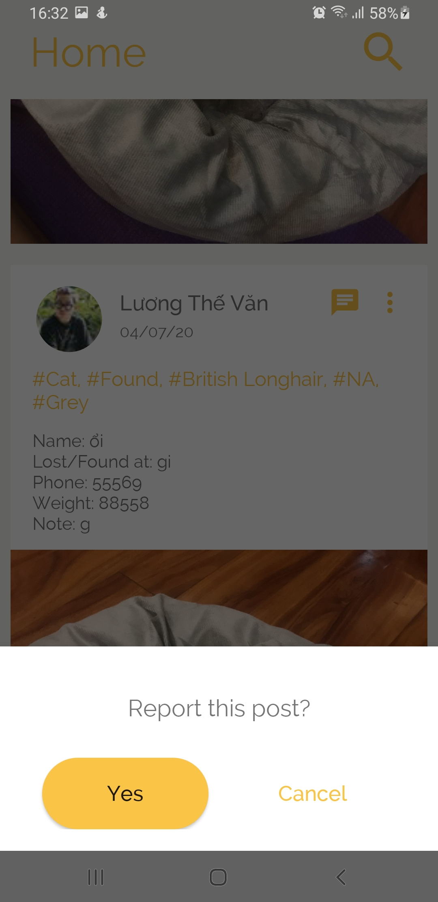
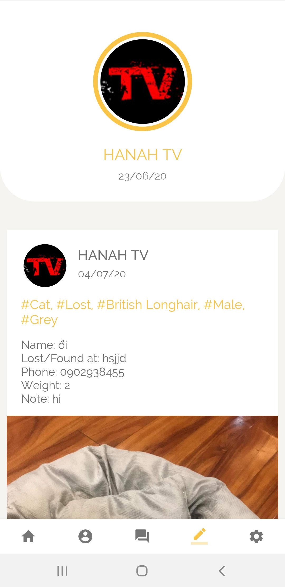
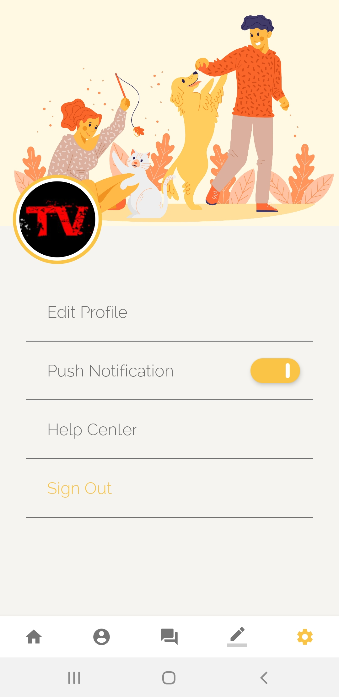

**Pinder - CS422 Final Project**

As an owner of a cat, I'm really scared of losing him. On Facebook,
there are lots of group for finding pets, but at this time those groups are kind of being used on the wrong purpose.
In addition, Facebook created Group feature not for any specific purpose. So I decided to make an Android application 
dedicated to finding pet by connecting people who found or lost their pets. The application is like a social community, 
but has been minimalized some basic features like reactions, comments, shares, etc... Only features that are helpful for
information of lost/found pet.

**App UI and features**

-   **Login screen:**
      You can choose between sign in by Facebook or sign in by Google Mail (Authenticated via Firebase Authentication

      
      
 -   **Homepage:**

      All the posts are stored and fetched Firebase Realtime Database with pre-defined structure.
      You can see that these posts are formated for users to easily get important information of found/missing pets
      
      
      
      If you find any pets that are similar to your found/missing one, you can directly chat to the post's user with 
      the chat button on top right corner. Or you can choose to report the post if the information is wrong/not related to 
      finding pet.
      
      
      
      
      
-   **Chat Feature:**
      Chat feature is hosted by Comet Chat (Free trial 30 days only). Users will get real-time incoming messages and previous 
      messages.
      
      
      
      
      
      The media message is not supported right now.
      
-   **Message Dialog Feature:**
      Display all conversations that current user joined.
      
      
      
-   **Profile and Setting Features:**
      Profile tab displays current user's name, avatar and created date. All user's posts are also displayed below.
      Setting tab let you choose some basic setting options like edit profile, sign out, help center.
      
      
      
      
      
-   **Admin webapp:**
      For Admin webapp, please refer to this repository: [Pinder Admin WebApp](https://github.com/nnphong1904/pet-dashboard)
